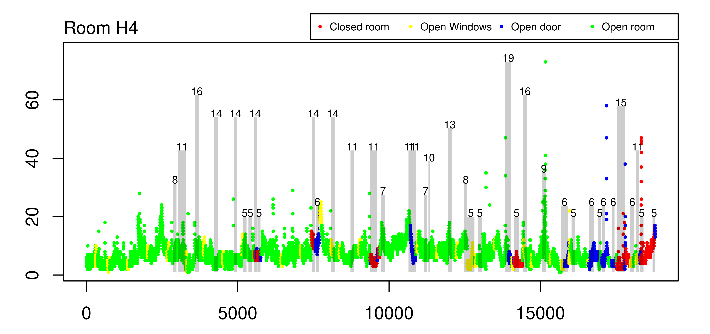

<style> body {text-align: justify} </style>

```{r setup, include=FALSE}
knitr::opts_chunk$set(echo = FALSE)
```

# Dados

Os dados foram coletados em duas campanhas: a primeira realizada durante o período de aulas remotas (dias úteis entre 26/07/2021 e 01/11/2021); e a segunda realizada após o retorno presencial (dias úteis entre 03/11/2021 e 17/12/2021). Neste relatório são consideradas apenas dados da Campanha 2. Nessa campanha foram consideradas duas salas: E5; e H4. Foram observadas as concentrações de Dióxido de Carbono (CO$_2$) e de Material Particulado (PM) com diâmetros inferiores a 2.5 e 10 µ$\text{m}$ (PM$_{2.5}$ e PM$_{10}$, respectivamente). Os mesmos poluentes também foram observados em ambiente externo, no acesso à instituição de ensino. Além dos poluentes, foram coletados dados sobre a ocupação e as áreas de abertura de portas e janelas. Originalmente, cada uma das variáveis foi observada a cada minuto.

As Figuras \@ref(fig:bpCO2), \@ref(fig:bpPM25) e \@ref(fig:bpPM10) a seguir apresentam as distribuições das concentrações dos poluentes com respeito a sala (E5 ou H4) e a situação da mesma (totalmente aberta - open room, somente porta aberta - open door, somente janela aberta - open window, e totalmente fechada - closed room).

```{r bpCO2, fig.cap = "Boxplot das concentrações de CO$_2$ em função da sala e da situação da mesma."}
knitr::include_graphics("figuras/boxplot_CO2.png")
```

```{r bpPM25, fig.cap = "Boxplot das concentrações de PM$_{2.5}$ em função da sala e da situação da mesma."}
knitr::include_graphics("figuras/boxplot_PM2.5.png")
```

```{r bpPM10, fig.cap = "Boxplot das concentrações de PM$_{10}$ em função da sala e da situação da mesma."}
knitr::include_graphics("figuras/boxplot_PM10.png")
```

Aparentemente, as figuras acima indicam que, no caso do CO$_2$, situações com a sala totalmente aberta parecem fornecer níveis menores do poluente, o que é esperado, tendo em vista que esse poluente pode ser emitido pelos ocupantes da sala, de modo que a sala aberta favorece a dissipação do mesmo. Para esse poluente, a situação da sala aparentemente tem um efeito importante, no sentido de que em situações de porta aberta e sala totalmente fechada as concentrações tendem a ser maiores na sala E5 em comparação com a sala H4. No caso do PM$_{2.5}$ e PM$_{10}$, percebemos a ocorrência de muitas observações discrepantes, o que inclusive dificulta a visualização dos boxplot's. Desses gráficos, não fica evidente uma diferença provocada pelo local da sala. Entretanto, o papel da situação da sala parece se inverter, quando comparado com o CO$_2$. Aparentemente, nesse caso, a sala totalmente aberta parece fornecer concentrações maiores do que em outras situações, o que pode ser explicado pelo fato de que os ocupantes não constituem fonte emissora de material particulado, sendo a grande maioria proveniente do ambiente externo, de modo que a sala aberta favoreceria ao aumento do efeito dos níveis externos nos níveis internos desses poluentes.

As Tabelas \@ref(tab:sumCO2), \@ref(tab:sumPM25) e \@ref(tab:sumPM10) abaixo mostram algumas medidas descritivas relativas a esses poluentes computadas em cada sala e em cada situação.

```{r sumCO2}
library(readxl)
tab_sum_CO2 <- read_excel("resultados.xls", 
    sheet = "CO2_summ")
knitr::kable(tab_sum_CO2, caption = 'Medidas resumo das concentrações de CO$_{2}$')
```

```{r sumPM25}
library(readxl)
tab_sum_CO2 <- read_excel("resultados.xls", 
    sheet = "PM2.5_summ")
knitr::kable(tab_sum_CO2, caption = 'Medidas resumo das concentrações de PM$_{2.5}$')
```

```{r sumPM10}
library(readxl)
tab_sum_CO2 <- read_excel("resultados.xls", 
    sheet = "PM10_summ")
knitr::kable(tab_sum_CO2, caption = 'Medidas resumo das concentrações de PM$_{10}$')
```

As tabelas acima parecem corroborar com as conclusões tiradas dos boxplot's apresentados anteriormente.

Além da distribuição dos poluentes em diferentes salas e em situações distintas, é interessante averiguar a dinâmica temporal dos mesmos. As Figuras \@ref(fig:tempCO2E5), \@ref(fig:tempCO2H4), \@ref(fig:tempPM25E5), \@ref(fig:tempPM25H4), \@ref(fig:tempPM10E5) e \@ref(fig:tempPM10H4) abaixo mostram a evolução dos poluentes e a da ocupação com o passar do tempo.

```{r tempCO2E5, fig.cap = "Evolução temporal do CO$_2$ e períodos de ocupação (retângulos cinzas) para a Sala E5, de acordo com a situação da sala: sala totalmente fechada (pontos vermelhos); apenas janela(s) aberta(s) (pontos amarelos); apenas porta(s) aberta(s) (pontos azuis); porta(s) e janelas(s) abertas (pontos verdes). Os números acima dos retângulos cinzas indicam a ocupação da sala no respectivo período."}
knitr::include_graphics("figuras/CO2_C5.png")
```

```{r tempCO2H4, fig.cap = "Evolução temporal do CO$_2$ e períodos de ocupação (retângulos cinzas) para a Sala H4, de acordo com a situação da sala: sala totalmente fechada (pontos vermelhos); apenas janela(s) aberta(s) (pontos amarelos); apenas porta(s) aberta(s) (pontos azuis); porta(s) e janelas(s) abertas (pontos verdes). Os números acima dos retângulos cinzas indicam a ocupação da sala no respectivo período."}
knitr::include_graphics("figuras/CO2_H4.png")
```

```{r tempPM25E5, fig.cap = "Evolução temporal do PM$_{2.5}$ e períodos de ocupação (retângulos cinzas) para a Sala E5, de acordo com a situação da sala: sala totalmente fechada (pontos vermelhos); apenas janela(s) aberta(s) (pontos amarelos); apenas porta(s) aberta(s) (pontos azuis); porta(s) e janelas(s) abertas (pontos verdes). Os números acima dos retângulos cinzas indicam a ocupação da sala no respectivo período."}

```

```{r tempPM25H4, fig.cap = "Evolução temporal do PM$_{2.5}$ e períodos de ocupação (retângulos cinzas) para a Sala H4, de acordo com a situação da sala: sala totalmente fechada (pontos vermelhos); apenas janela(s) aberta(s) (pontos amarelos); apenas porta(s) aberta(s) (pontos azuis); porta(s) e janelas(s) abertas (pontos verdes). Os números acima dos retângulos cinzas indicam a ocupação da sala no respectivo período."}

```

```{r tempPM10E5, fig.cap = "Evolução temporal do PM$_{10}$ e períodos de ocupação (retângulos cinzas) para a Sala E5, de acordo com a situação da sala: sala totalmente fechada (pontos vermelhos); apenas janela(s) aberta(s) (pontos amarelos); apenas porta(s) aberta(s) (pontos azuis); porta(s) e janelas(s) abertas (pontos verdes). Os números acima dos retângulos cinzas indicam a ocupação da sala no respectivo período."}

```

```{r tempPM10H4, fig.cap = "Evolução temporal do PM$_{10}$ e períodos de ocupação (retângulos cinzas) para a Sala H4, de acordo com a situação da sala: sala totalmente fechada (pontos vermelhos); apenas janela(s) aberta(s) (pontos amarelos); apenas porta(s) aberta(s) (pontos azuis); porta(s) e janelas(s) abertas (pontos verdes). Os números acima dos retângulos cinzas indicam a ocupação da sala no respectivo período."}

```

Dos gráficos de evolução acima é possível notar que: (1) para o CO$_2$ é nítido um efeito positivo da ocupação da sala, o mesmo não fica claro para o PM$_{2.5}$ e o PM$_{10}$; (2) para o CO$_2$, fica nítida a diferença de comportamento entre as Salas E5 e H4, por exemplo, na Sala E5, a sala estar totalmente fechada provoca um incremento muito maior do CO$_2$ reportado, enquanto que na Sala H4 essa diferença parece ser muito menos dramática; (3) para o CO$_2$ é notável que o aumento da ocupação da sala provoca um aumento progressivo (não instantâneo) no CO$_2$; (4) a sala H4 aparentemente apresentou valores discrepantes de PM$_{2.5}$ e de PM$_{10}$. É importante avaliar se se tratam de falhas de equipamento; (5) se não se tratar de falha o que é descrito no Item (4), é notável a diferença de comportamento do PM$_{2.5}$ e do PM$_{10}$ entre as Salas E5 e H4, a saber, os valores discrepantes ocorreram na Sala H4, o que pode indicar a influência de algum fator responsável por causar essas altas concentrações.

Para evitar a necessidade de se considerar um modelo extremamente complexo para explicar o comportamento discutido no Item (3), foi realizada a agregação dos dados como se segue. A cada hora, e a cada mudança de abertura de janelas e/ou portas ou de ocupação, as demais variáveis (concentrações internas e externas de CO$_2$, PM$_{2.5}$ e PM$_{10}$) foram agregadas por meio da média aritmética.

A metodologia estatística empregada para a análise dos dados é brevemente introduzida a seguir.

# Metodologia

Para a análise dos dados foi utilizada análise de regressão linear múltipla. O modelo considerado para a Sala E5 foi
$$
\begin{aligned}
\text{Pol}_t = a_0 + a_1 \cdot \text{Pol}_{t-1} + a_2 \cdot \text{Pol}_{t,\text{Ex}} + a_3 \cdot \text{Oc}_t + a_4 \cdot \text{Ab}_{t,\text{porta}} + a_5 \cdot \text{Ab}_{t,\text{janela}} + a_6 \cdot (\text{Oc}_t \cdot \text{Ab}_{t,\text{porta}}) +\\ a_7 \cdot (\text{Oc}_t \cdot \text{Ab}_{t,\text{janela}}) + e_t,
\end{aligned}
$$
enquanto que na Sala H4 foi
$$
\begin{aligned}
\text{Pol}_t = (a_0 + a_0^*) + (a_1 + a_1^*) \cdot \text{Pol}_{t-1} + (a_2 + a_2^*) \cdot \text{Pol}_{t,\text{Ex}} + (a_3 + a_3^*) \cdot \text{Oc}_t + (a_4 + a_4^*) \cdot \text{Ab}_{t,\text{porta}} +\\ (a_5 + a_5^*) \cdot \text{Ab}_{t,\text{janela}} + (a_6 + a_6^*) \cdot (\text{Oc}_t \cdot \text{Ab}_{t,\text{porta}}) + (a_7 + a_7^*) \cdot (\text{Oc}_t \cdot \text{Ab}_{t,\text{janela}}) + e_t^*,
\end{aligned}
$$
em que $\text{Pol}_t$ denota o nível do poluente (CO$_2$, PM$_{2.5}$ ou PM$_{10}$) no instante $t$, $\text{Oc}_t$ denota a ocupação da sala no instante $t$, $\text{Pol}_{t,\text{Ex}}$ denota o nível do poluente no ambiente externo no instante $t$, $\text{Ab}_{t,\text{porta}}$ e $\text{Ab}_{t,\text{janela}}$ denotam as aberturas (em $\text{m}^2$) de portas e janelas no instante $t$, respectivamente, $e_t$ e $e_t^*$ são termos de erro aleatório e $a_i^*$ denota o efeito da sala H4 no coeficiente $a_i$ (a Sala E5 foi utilizada como nível de referência). Note que os modelos acima consideram interações entre as aberturas de portas e janelas no efeito da ocupação. Por exemplo, para a Sala E5, supondo que $a_6 < 0$, quando a porta está aberta ($\text{Ab}_{t,\text{porta}} > 0$), tem-se que o efeito da ocupação passa a ser $a_2 + a_6 < a_2$, ou seja, nesse cenário, o fato de a porta estar aberta, causa uma redução do efeito da ocupação no nível observado do poluente.

Os parâmetros foram estimados via máxima verossimilhança (gaussiana), isto é, para a estimação dos parâmetros, está sendo assumido que $e_t \sim N(0, \sigma^2)$ e $e_t^* \sim N(0, \sigma^{2*})$. Foram realizados os testes de hipóteses ANOVA e t-student. Adiante, será visto que os resíduos não passaram no teste de normalidade (Shapiro-Wilks). Portanto, foi utilizada a técnica \textit{residual bootstrap} para obtenção de p-valores corrigidos para ambos os testes. Tanto para a ANOVA, quanto para o teste t-student, as reamostras bootstrap foram construídas sob a hipótese nula correspondente a cada teste. Para maiores detalhes veja @efron:1979 e @ter1992.

# Resultados e discussão

## Dióxido de Carbono – CO$_2$

Após aplicar a análise de regressão, obteve-se os resíduos, cujo histograma é apresentado na Figura \@ref(fig:histCO2), juntamente com a densidade normal com a respectiva média e desvio-padrão (linha em vermelho). Fica claro que o modelo normal não parece se adequar bem aos resíduos, o que é confirmado pelo teste de Shapiro-Wilks que rejeita a normalidade ($p$-valor $< 10^{-16}$).

```{r histCO2, out.width = "400px", fig.cap = "Histograma dos resíduos do modelo de regressão para os dados de CO$_2$."}
knitr::include_graphics("figuras/hist_res_CO2.png")
```

Devido a confirmação de não normalidade, foi empregada a metodologia bootstrap para obtenção de $p$-valores corrigidos. Para efeito de comparação, os $p$-valores gaussianos também são apresentados. Os resultados são apresentados nas Tabelas \@ref(tab:anovaCO2) (ANOVA) e \@ref(tab:tstudCO2) (t-student).

```{r anovaCO2}
library(readxl)
tab_sum_CO2 <- read_excel("resultados.xls", 
    sheet = "CO2_ANOVA")
knitr::kable(tab_sum_CO2, caption = 'Resultado dos $p$-valores do teste ANOVA para os dados de CO$_2$.')
```

```{r tstudCO2}
library(readxl)
tab_sum_CO2 <- read_excel("resultados.xls", 
    sheet = "CO2_t_stud")
knitr::kable(tab_sum_CO2, caption = 'Estimativas dos coeficientes e respectivos $p$-valores do teste t-student para os dados de CO$_2$.')
```

## Material Particulado com diâmetro $< 2.5$ µ$\text{m}$ – PM$_{2.5}$

Após aplicar a análise de regressão, obteve-se os resíduos, cujo histograma é apresentado na Figura \@ref(fig:histPM25), juntamente com a densidade normal com a respectiva média e desvio-padrão (linha em vermelho). Fica claro que o modelo normal não parece se adequar bem aos resíduos, o que é confirmado pelo teste de Shapiro-Wilks que rejeita a normalidade ($p$-valor $< 10^{-16}$). É importante ressaltar as caudas extremamente pesadas do histograma, o que pode ter sido provocado pelas observações suspeitas de serem discrepantes.

```{r histPM25, out.width = "400px", fig.cap = "Histograma dos resíduos do modelo de regressão para os dados de PM$_{2.5}$."}

```

Devido a confirmação de não normalidade, foi empregada a metodologia bootstrap para obtenção de $p$-valores corrigidos. Para efeito de comparação, os $p$-valores gaussianos também são apresentados. Os resultados são apresentados nas Tabelas \@ref(tab:anovaPM25) (ANOVA) e \@ref(tab:tstudPM25) (t-student).

```{r anovaPM25}
library(readxl)
tab_sum_CO2 <- read_excel("resultados.xls", 
    sheet = "PM2.5_ANOVA")
knitr::kable(tab_sum_CO2, caption = 'Resultado dos $p$-valores do teste ANOVA para os dados de PM$_{2.5}$.')
```

```{r tstudPM25}
library(readxl)
tab_sum_CO2 <- read_excel("resultados.xls", 
    sheet = "PM2.5_t_stud")
knitr::kable(tab_sum_CO2, caption = 'Estimativas dos coeficientes e respectivos $p$-valores do teste t-student para os dados de PM$_{2.5}$.')
```

## Material Particulado com diâmetro $< 10$ µ$\text{m}$ – PM$_{10}$

Após aplicar a análise de regressão, obteve-se os resíduos, cujo histograma é apresentado na Figura \@ref(fig:histPM10), juntamente com a densidade normal com a respectiva média e desvio-padrão (linha em vermelho). Fica claro que o modelo normal não parece se adequar bem aos resíduos, o que é confirmado pelo teste de Shapiro-Wilks que rejeita a normalidade ($p$-valor $< 10^{-16}$). É importante ressaltar as caudas extremamente pesadas do histograma, o que pode ter sido provocado pelas observações suspeitas de serem discrepantes.

```{r histPM10, out.width = "400px", fig.cap = "Histograma dos resíduos do modelo de regressão para os dados de PM$_{10}$."}
knitr::include_graphics("figuras/hist_res_PM10.png")
```

Devido a confirmação de não normalidade, foi empregada a metodologia bootstrap para obtenção de $p$-valores corrigidos. Para efeito de comparação, os $p$-valores gaussianos também são apresentados. Os resultados são apresentados nas Tabelas \@ref(tab:anovaPM10) (ANOVA) e \@ref(tab:tstudPM10) (t-student).

```{r anovaPM10}
library(readxl)
tab_sum_CO2 <- read_excel("resultados.xls", 
    sheet = "PM10_ANOVA")
knitr::kable(tab_sum_CO2, caption = 'Resultado dos $p$-valores do teste ANOVA para os dados de PM$_{10}$.')
```

```{r tstudPM10}
library(readxl)
tab_sum_CO2 <- read_excel("resultados.xls", 
    sheet = "PM10_t_stud")
knitr::kable(tab_sum_CO2, caption = 'Estimativas dos coeficientes e respectivos $p$-valores do teste t-student para os dados de PM$_{10}$.')
```

# Referências