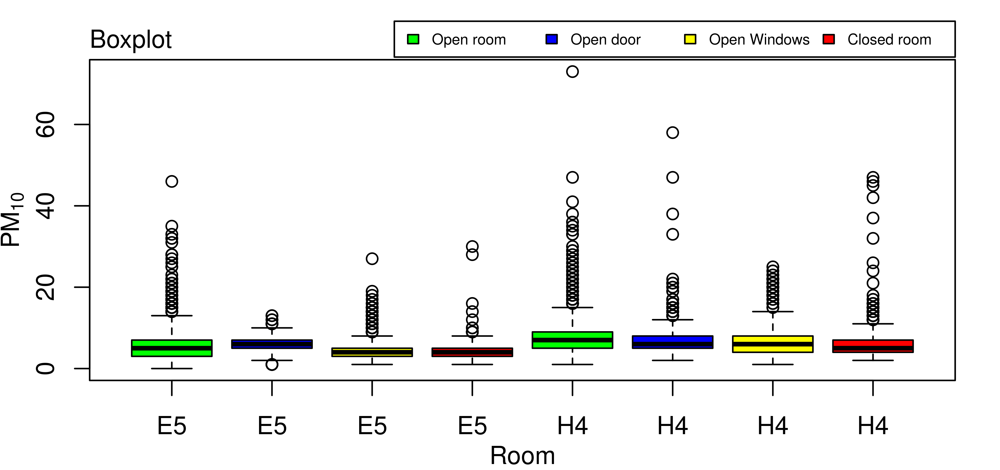
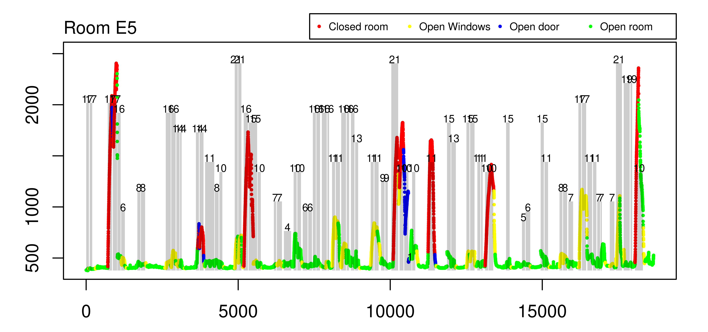
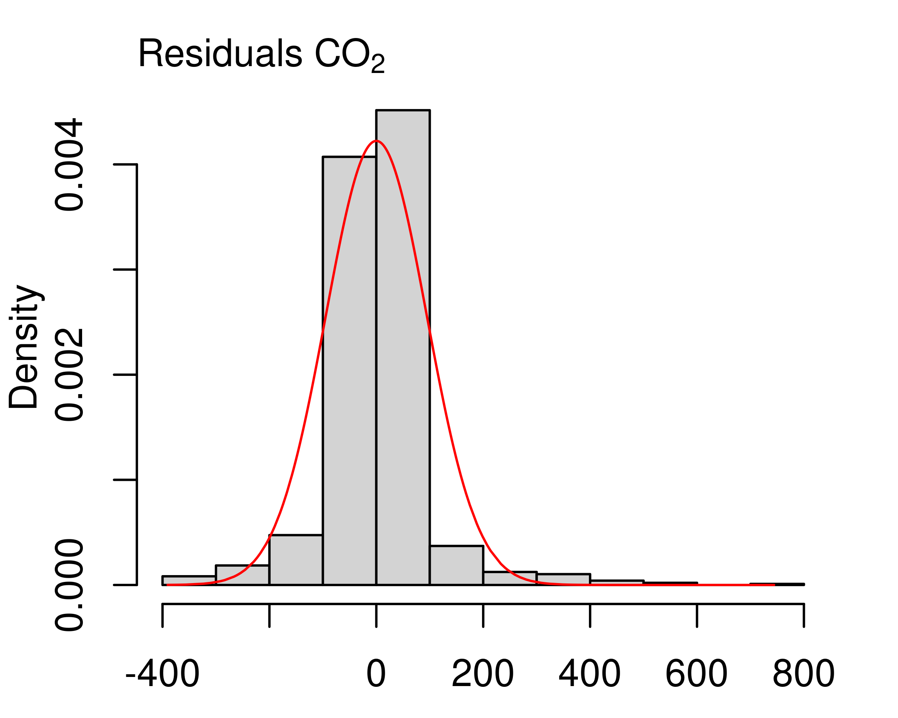
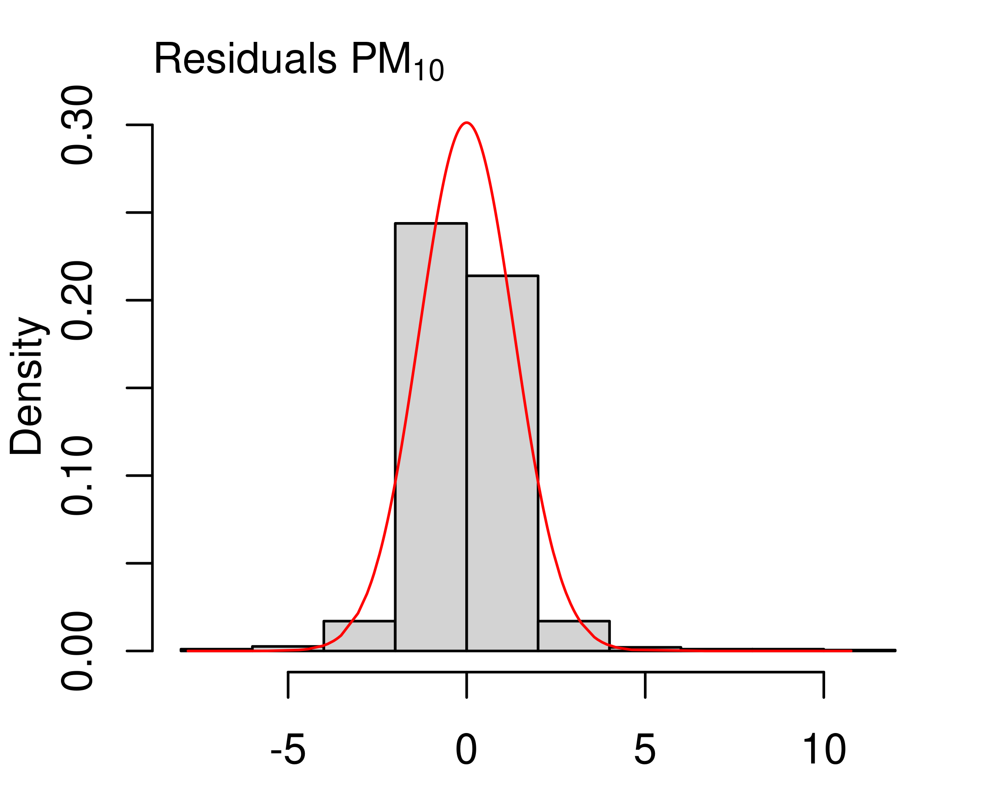

# Dados

Os dados foram coletados em duas campanhas: a primeira realizada durante o período de aulas remotas (dias úteis entre 26/07/2021 e 01/11/2021); e a segunda realizada após o retorno presencial (dias úteis entre 03/11/2021 e 17/12/2021). Neste relatório são consideradas apenas dados da Campanha 2. Nessa campanha foram consideradas duas salas: E5; e H4. Foram observadas as concentrações de Dióxido de Carbono (CO$_2$) e de Material Particulado (PM) com diâmetros inferiores a 2.5 e 10 µ$\text{m}$ (PM$_{2.5}$ e PM$_{10}$, respectivamente). Os mesmos poluentes também foram observados em ambiente externo, no acesso à instituição de ensino. Além dos poluentes, foram coletados dados sobre a ocupação e as áreas de abertura de portas e janelas. Originalmente, cada uma das variáveis foi observada a cada minuto.

As Figuras \@ref(fig:bpCO2), \@ref(fig:bpPM25) e \@ref(fig:bpPM10) a seguir apresentam as distribuições das concentrações dos poluentes com respeito a sala (E5 ou H4) e a situação da mesma (totalmente aberta - open room, somente porta aberta - open door, somente janela aberta - open window, e totalmente fechada - closed room).

(\#fig:bpCO2)Boxplot das concentrações de CO$_2$ em função da sala e da situação da mesma.

(\#fig:bpPM25)Boxplot das concentrações de PM$_{2.5}$ em função da sala e da situação da mesma.

(\#fig:bpPM10)Boxplot das concentrações de PM$_{10}$ em função da sala e da situação da mesma.

Aparentemente, as figuras acima indicam que, no caso do CO$_2$, situações com a sala totalmente aberta parecem fornecer níveis menores do poluente, o que é esperado, tendo em vista que esse poluente pode ser emitido pelos ocupantes da sala, de modo que a sala aberta favorece a dissipação do mesmo. Para esse poluente, a situação da sala aparentemente tem um efeito importante, no sentido de que em situações de porta aberta e sala totalmente fechada as concentrações tendem a ser maiores na sala E5 em comparação com a sala H4. No caso do PM$_{2.5}$ e PM$_{10}$, percebemos a ocorrência de muitas observações discrepantes, o que inclusive dificulta a visualização dos boxplot's. Desses gráficos, não fica evidente uma diferença provocada pelo local da sala. Entretanto, o papel da situação da sala parece se inverter, quando comparado com o CO$_2$. Aparentemente, nesse caso, a sala totalmente aberta parece fornecer concentrações maiores do que em outras situações, o que pode ser explicado pelo fato de que os ocupantes não constituem fonte emissora de material particulado, sendo a grande maioria proveniente do ambiente externo, de modo que a sala aberta favoreceria ao aumento do efeito dos níveis externos nos níveis internos desses poluentes.

As Tabelas \@ref(tab:sumCO2), \@ref(tab:sumPM25) e \@ref(tab:sumPM10) abaixo mostram algumas medidas descritivas relativas a esses poluentes computadas em cada sala e em cada situação.

Table: (\#tab:sumCO2)Medidas resumo das concentrações de CO$_{2}$

|LOCAL |SALA | min| 1st quantile| median| mean| std. dev.| 3rd quantile|  max|
|:-----|:----|---:|------------:|------:|----:|---------:|------------:|----:|
|C5    |OR   | 378|          409|    424|  456|     129.0|          456| 2304|
|C5    |OD   | 433|          494|    931|  938|     431.0|         1146| 1974|
|C5    |OW   | 395|          423|    464|  553|     188.0|          603| 1319|
|C5    |CR   | 417|          868|   1311| 1283|     466.0|         1609| 2406|
|H4    |OR   | 375|          404|    412|  442|      93.7|          436| 1180|
|H4    |OD   | 399|          436|    512|  580|     204.0|          636| 1588|
|H4    |OW   | 390|          404|    413|  535|     226.0|          631| 1366|
|H4    |CR   | 401|          530|    711|  835|     385.0|         1024| 1786|

Table: (\#tab:sumPM25)Medidas resumo das concentrações de PM$_{2.5}$

|LOCAL |SALA | min| 1st quantile| median| mean| std. dev.| 3rd quantile| max|
|:-----|:----|---:|------------:|------:|----:|---------:|------------:|---:|
|C5    |OR   |   0|            2|      3| 3.14|      1.96|            4|  26|
|C5    |OD   |   0|            3|      3| 3.61|      1.47|            4|   9|
|C5    |OW   |   0|            2|      2| 2.64|      1.39|            3|  15|
|C5    |CR   |   0|            2|      2| 2.58|      1.38|            3|  27|
|H4    |OR   |   1|            3|      4| 4.65|      2.28|            6|  68|
|H4    |OD   |   1|            3|      4| 4.21|      2.23|            5|  34|
|H4    |OW   |   1|            3|      4| 4.10|      2.17|            5|  16|
|H4    |CR   |   1|            3|      3| 3.99|      2.94|            5|  45|

Table: (\#tab:sumPM10)Medidas resumo das concentrações de PM$_{10}$

|LOCAL |SALA | min| 1st quantile| median| mean| std. dev.| 3rd quantile| max|
|:-----|:----|---:|------------:|------:|----:|---------:|------------:|---:|
|C5    |OR   |   0|            3|      5| 5.25|      2.90|            7|  46|
|C5    |OD   |   1|            5|      6| 5.97|      2.28|            7|  13|
|C5    |OW   |   1|            3|      4| 4.44|      2.13|            5|  27|
|C5    |CR   |   1|            3|      4| 4.35|      1.93|            5|  30|
|H4    |OR   |   1|            5|      7| 7.28|      3.28|            9|  73|
|H4    |OD   |   2|            5|      6| 6.70|      3.61|            8|  58|
|H4    |OW   |   1|            4|      6| 6.42|      3.39|            8|  25|
|H4    |CR   |   2|            4|      5| 6.15|      3.63|            7|  47|

As tabelas acima parecem corroborar com as conclusões tiradas dos boxplot's apresentados anteriormente.

Além da distribuição dos poluentes em diferentes salas e em situações distintas, é interessante averiguar a dinâmica temporal dos mesmos. As Figuras \@ref(fig:tempCO2E5), \@ref(fig:tempCO2H4), \@ref(fig:tempPM25E5), \@ref(fig:tempPM25H4), \@ref(fig:tempPM10E5) e \@ref(fig:tempPM10H4) abaixo mostram a evolução dos poluentes e a da ocupação com o passar do tempo.

(\#fig:tempCO2E5)Evolução temporal do CO$_2$ e períodos de ocupação (retângulos cinzas) para a Sala E5, de acordo com a situação da sala: sala totalmente fechada (pontos vermelhos); apenas janela(s) aberta(s) (pontos amarelos); apenas porta(s) aberta(s) (pontos azuis); porta(s) e janelas(s) abertas (pontos verdes). Os números acima dos retângulos cinzas indicam a ocupação da sala no respectivo período.

(\#fig:tempCO2H4)Evolução temporal do CO$_2$ e períodos de ocupação (retângulos cinzas) para a Sala H4, de acordo com a situação da sala: sala totalmente fechada (pontos vermelhos); apenas janela(s) aberta(s) (pontos amarelos); apenas porta(s) aberta(s) (pontos azuis); porta(s) e janelas(s) abertas (pontos verdes). Os números acima dos retângulos cinzas indicam a ocupação da sala no respectivo período.

(\#fig:tempPM25E5)Evolução temporal do PM$_{2.5}$ e períodos de ocupação (retângulos cinzas) para a Sala E5, de acordo com a situação da sala: sala totalmente fechada (pontos vermelhos); apenas janela(s) aberta(s) (pontos amarelos); apenas porta(s) aberta(s) (pontos azuis); porta(s) e janelas(s) abertas (pontos verdes). Os números acima dos retângulos cinzas indicam a ocupação da sala no respectivo período.

(\#fig:tempPM25H4)Evolução temporal do PM$_{2.5}$ e períodos de ocupação (retângulos cinzas) para a Sala H4, de acordo com a situação da sala: sala totalmente fechada (pontos vermelhos); apenas janela(s) aberta(s) (pontos amarelos); apenas porta(s) aberta(s) (pontos azuis); porta(s) e janelas(s) abertas (pontos verdes). Os números acima dos retângulos cinzas indicam a ocupação da sala no respectivo período.

(\#fig:tempPM10E5)Evolução temporal do PM$_{10}$ e períodos de ocupação (retângulos cinzas) para a Sala E5, de acordo com a situação da sala: sala totalmente fechada (pontos vermelhos); apenas janela(s) aberta(s) (pontos amarelos); apenas porta(s) aberta(s) (pontos azuis); porta(s) e janelas(s) abertas (pontos verdes). Os números acima dos retângulos cinzas indicam a ocupação da sala no respectivo período.

(\#fig:tempPM10H4)Evolução temporal do PM$_{10}$ e períodos de ocupação (retângulos cinzas) para a Sala H4, de acordo com a situação da sala: sala totalmente fechada (pontos vermelhos); apenas janela(s) aberta(s) (pontos amarelos); apenas porta(s) aberta(s) (pontos azuis); porta(s) e janelas(s) abertas (pontos verdes). Os números acima dos retângulos cinzas indicam a ocupação da sala no respectivo período.

Dos gráficos de evolução acima é possível notar que: (1) para o CO$_2$ é nítido um efeito positivo da ocupação da sala, o mesmo não fica claro para o PM$_{2.5}$ e o PM$_{10}$; (2) para o CO$_2$, fica nítida a diferença de comportamento entre as Salas E5 e H4, por exemplo, na Sala E5, a sala estar totalmente fechada provoca um incremento muito maior do CO$_2$ reportado, enquanto que na Sala H4 essa diferença parece ser muito menos dramática; (3) para o CO$_2$ é notável que o aumento da ocupação da sala provoca um aumento progressivo (não instantâneo) no CO$_2$; (4) a sala H4 aparentemente apresentou valores discrepantes de PM$_{2.5}$ e de PM$_{10}$. É importante avaliar se se tratam de falhas de equipamento; (5) se não se tratar de falha o que é descrito no Item (4), é notável a diferença de comportamento do PM$_{2.5}$ e do PM$_{10}$ entre as Salas E5 e H4, a saber, os valores discrepantes ocorreram na Sala H4, o que pode indicar a influência de algum fator responsável por causar essas altas concentrações.

Para evitar a necessidade de se considerar um modelo extremamente complexo para explicar o comportamento discutido no Item (3), foi realizada a agregação dos dados como se segue. A cada hora, e a cada mudança de abertura de janelas e/ou portas ou de ocupação, as demais variáveis (concentrações internas e externas de CO$_2$, PM$_{2.5}$ e PM$_{10}$) foram agregadas por meio da média aritmética.

A metodologia estatística empregada para a análise dos dados é brevemente introduzida a seguir.

# Metodologia

Para a análise dos dados foi utilizada análise de regressão linear múltipla. O modelo considerado para a Sala E5 foi
$$
\begin{aligned}
\text{Pol}_t = a_0 + a_1 \cdot \text{Pol}_{t-1} + a_2 \cdot \text{Pol}_{t,\text{Ex}} + a_3 \cdot \text{Oc}_t + a_4 \cdot \text{Ab}_{t,\text{porta}} + a_5 \cdot \text{Ab}_{t,\text{janela}} + a_6 \cdot (\text{Oc}_t \cdot \text{Ab}_{t,\text{porta}}) +\\ a_7 \cdot (\text{Oc}_t \cdot \text{Ab}_{t,\text{janela}}) + e_t,
\end{aligned}
$$
enquanto que na Sala H4 foi
$$
\begin{aligned}
\text{Pol}_t = (a_0 + a_0^*) + (a_1 + a_1^*) \cdot \text{Pol}_{t-1} + (a_2 + a_2^*) \cdot \text{Pol}_{t,\text{Ex}} + (a_3 + a_3^*) \cdot \text{Oc}_t + (a_4 + a_4^*) \cdot \text{Ab}_{t,\text{porta}} +\\ (a_5 + a_5^*) \cdot \text{Ab}_{t,\text{janela}} + (a_6 + a_6^*) \cdot (\text{Oc}_t \cdot \text{Ab}_{t,\text{porta}}) + (a_7 + a_7^*) \cdot (\text{Oc}_t \cdot \text{Ab}_{t,\text{janela}}) + e_t^*,
\end{aligned}
$$
em que $\text{Pol}_t$ denota o nível do poluente (CO$_2$, PM$_{2.5}$ ou PM$_{10}$) no instante $t$, $\text{Oc}_t$ denota a ocupação da sala no instante $t$, $\text{Pol}_{t,\text{Ex}}$ denota o nível do poluente no ambiente externo no instante $t$, $\text{Ab}_{t,\text{porta}}$ e $\text{Ab}_{t,\text{janela}}$ denotam as aberturas (em $\text{m}^2$) de portas e janelas no instante $t$, respectivamente, $e_t$ e $e_t^*$ são termos de erro aleatório e $a_i^*$ denota o efeito da sala H4 no coeficiente $a_i$ (a Sala E5 foi utilizada como nível de referência). Note que os modelos acima consideram interações entre as aberturas de portas e janelas no efeito da ocupação. Por exemplo, para a Sala E5, supondo que $a_6 < 0$, quando a porta está aberta ($\text{Ab}_{t,\text{porta}} > 0$), tem-se que o efeito da ocupação passa a ser $a_2 + a_6 < a_2$, ou seja, nesse cenário, o fato de a porta estar aberta, causa uma redução do efeito da ocupação no nível observado do poluente.

Os parâmetros foram estimados via máxima verossimilhança (gaussiana), isto é, para a estimação dos parâmetros, está sendo assumido que $e_t \sim N(0, \sigma^2)$ e $e_t^* \sim N(0, \sigma^{2*})$. Foram realizados os testes de hipóteses ANOVA e t-student. Adiante, será visto que os resíduos não passaram no teste de normalidade (Shapiro-Wilks). Portanto, foi utilizada a técnica \textit{residual bootstrap} para obtenção de p-valores corrigidos para ambos os testes. Tanto para a ANOVA, quanto para o teste t-student, as reamostras bootstrap foram construídas sob a hipótese nula correspondente a cada teste. Para maiores detalhes veja @efron:1979 e @ter1992.

# Resultados e discussão

## Dióxido de Carbono – CO$_2$

Após aplicar a análise de regressão, obteve-se os resíduos, cujo histograma é apresentado na Figura \@ref(fig:histCO2), juntamente com a densidade normal com a respectiva média e desvio-padrão (linha em vermelho). Fica claro que o modelo normal não parece se adequar bem aos resíduos, o que é confirmado pelo teste de Shapiro-Wilks que rejeita a normalidade ($p$-valor $< 10^{-16}$).

(\#fig:histCO2)Histograma dos resíduos do modelo de regressão para os dados de CO$_2$.

Devido a confirmação de não normalidade, foi empregada a metodologia bootstrap para obtenção de $p$-valores corrigidos. Para efeito de comparação, os $p$-valores gaussianos também são apresentados. Os resultados são apresentados nas Tabelas \@ref(tab:anovaCO2) (ANOVA) e \@ref(tab:tstudCO2) (t-student).

Table: (\#tab:anovaCO2)Resultado dos $p$-valores do teste ANOVA para os dados de CO$_2$.

|Term                     |Gaussiano |Bootstrap |
|:------------------------|:---------|:---------|
|SALA                     |0.0000    |0.0005    |
|OCUPACAO                 |0.0000    |0.0005    |
|PORTA                    |0.0000    |0.0005    |
|JANELA                   |0.0000    |0.0005    |
|CO2_L1                   |0.0000    |0.0005    |
|CO2_Ex                   |0.0006    |0.0005    |
|SALA x OCUPACAO          |0.0000    |0.0005    |
|SALA x PORTA             |0.8535    |0.8975    |
|OCUPACAO x PORTA         |0.0000    |0.0005    |
|SALA x JANELA            |0.0015    |0.0010    |
|OCUPACAO x JANELA        |0.0000    |0.0005    |
|SALA x CO2_L1            |0.0000    |0.0005    |
|SALA x CO2_Ex            |0.9202    |0.8925    |
|SALA x OCUPACAO x PORTA  |0.0000    |0.0005    |
|SALA x OCUPACAO x JANELA |0.8770    |0.8790    |

Table: (\#tab:tstudCO2)Estimativas dos coeficientes e respectivos $p$-valores do teste t-student para os dados de CO$_2$.

|Parameter                  |Estimate |Gaussiano |Bootstrap |
|:--------------------------|:--------|:---------|:---------|
|(Intercept)                |159.3955 |0.1398    |0.1500    |
|SALAH4                     |17.1475  |0.9114    |0.8875    |
|OCUPACAO                   |16.5962  |0.0000    |0.0005    |
|PORTA                      |1.9940   |0.7570    |0.7680    |
|JANELA                     |-0.3446  |0.8482    |0.9770    |
|CO2_L1                     |0.8161   |0.0000    |0.0005    |
|CO2_Ex                     |-0.2134  |0.3801    |0.3140    |
|SALAH4 x OCUPACAO          |16.4573  |0.0000    |0.0005    |
|SALAH4 x PORTA             |0.7553   |0.9405    |0.9395    |
|OCUPACAO x PORTA           |-5.4624  |0.0000    |0.0005    |
|SALAH4 x JANELA            |0.7716   |0.8852    |0.9095    |
|OCUPACAO x JANELA          |-1.0283  |0.0000    |0.0005    |
|SALAH4 x CO2_L1            |-0.2281  |0.0000    |0.0005    |
|SALAH4 x CO2_Ex            |0.1795   |0.6107    |0.5345    |
|SALAH4 x OCUPACAO x PORTA  |-8.9045  |0.0000    |0.0005    |
|SALAH4 x OCUPACAO x JANELA |-0.1518  |0.8770    |0.8790    |

## Material Particulado com diâmetro $< 2.5$ µ$\text{m}$ – PM$_{2.5}$

Após aplicar a análise de regressão, obteve-se os resíduos, cujo histograma é apresentado na Figura \@ref(fig:histPM25), juntamente com a densidade normal com a respectiva média e desvio-padrão (linha em vermelho). Fica claro que o modelo normal não parece se adequar bem aos resíduos, o que é confirmado pelo teste de Shapiro-Wilks que rejeita a normalidade ($p$-valor $< 10^{-16}$). É importante ressaltar as caudas extremamente pesadas do histograma, o que pode ter sido provocado pelas observações suspeitas de serem discrepantes.

(\#fig:histPM25)Histograma dos resíduos do modelo de regressão para os dados de PM$_{2.5}$.

Devido a confirmação de não normalidade, foi empregada a metodologia bootstrap para obtenção de $p$-valores corrigidos. Para efeito de comparação, os $p$-valores gaussianos também são apresentados. Os resultados são apresentados nas Tabelas \@ref(tab:anovaPM25) (ANOVA) e \@ref(tab:tstudPM25) (t-student).

Table: (\#tab:anovaPM25)Resultado dos $p$-valores do teste ANOVA para os dados de PM$_{2.5}$.

|Term                     |Gaussiano |Bootstrap |
|:------------------------|:---------|:---------|
|SALA                     |0.0000    |0.0005    |
|OCUPACAO                 |0.1791    |0.1650    |
|PORTA                    |0.0000    |0.0005    |
|JANELA                   |0.1832    |0.1255    |
|PM2.5_L1                 |0.0000    |0.0005    |
|PM2.5_Ex                 |0.0000    |0.0005    |
|SALA x OCUPACAO          |0.5384    |0.5855    |
|SALA x PORTA             |0.6028    |0.6280    |
|OCUPACAO x PORTA         |0.0559    |0.0310    |
|SALA x JANELA            |0.9277    |0.9440    |
|OCUPACAO x JANELA        |0.1012    |0.0635    |
|SALA x PM2.5_L1          |0.5801    |0.5855    |
|SALA x PM2.5_Ex          |0.2091    |0.2365    |
|SALA x OCUPACAO x PORTA  |0.4684    |0.5580    |
|SALA x OCUPACAO x JANELA |0.6105    |0.6660    |

Table: (\#tab:tstudPM25)Estimativas dos coeficientes e respectivos $p$-valores do teste t-student para os dados de PM$_{2.5}$.

|Parameter                  |Estimate |Gaussiano |Bootstrap |
|:--------------------------|:--------|:---------|:---------|
|(Intercept)                |0.4873   |0.0119    |0.0025    |
|SALAH4                     |0.1471   |0.5829    |0.6120    |
|OCUPACAO                   |-0.0296  |0.0226    |0.0060    |
|PORTA                      |-0.0192  |0.7796    |0.7200    |
|JANELA                     |-0.0425  |0.0251    |0.0110    |
|PM2.5_L1                   |0.7006   |0.0000    |0.0005    |
|PM2.5_Ex                   |0.1202   |0.0000    |0.0005    |
|SALAH4 x OCUPACAO          |0.0113   |0.6388    |0.6785    |
|SALAH4 x PORTA             |0.0401   |0.7135    |0.7145    |
|OCUPACAO x PORTA           |0.0065   |0.3737    |0.2610    |
|SALAH4 x JANELA            |0.0234   |0.6746    |0.7330    |
|OCUPACAO x JANELA          |0.0036   |0.0930    |0.0470    |
|SALAH4 x PM2.5_L1          |-0.0449  |0.2939    |0.3345    |
|SALAH4 x PM2.5_Ex          |0.0332   |0.2280    |0.2605    |
|SALAH4 x OCUPACAO x PORTA  |0.0145   |0.3840    |0.4905    |
|SALAH4 x OCUPACAO x JANELA |-0.0054  |0.6105    |0.6660    |

## Material Particulado com diâmetro $< 10$ µ$\text{m}$ – PM$_{10}$

Após aplicar a análise de regressão, obteve-se os resíduos, cujo histograma é apresentado na Figura \@ref(fig:histPM10), juntamente com a densidade normal com a respectiva média e desvio-padrão (linha em vermelho). Fica claro que o modelo normal não parece se adequar bem aos resíduos, o que é confirmado pelo teste de Shapiro-Wilks que rejeita a normalidade ($p$-valor $< 10^{-16}$). É importante ressaltar as caudas extremamente pesadas do histograma, o que pode ter sido provocado pelas observações suspeitas de serem discrepantes.

(\#fig:histPM10)Histograma dos resíduos do modelo de regressão para os dados de PM$_{10}$.

Devido a confirmação de não normalidade, foi empregada a metodologia bootstrap para obtenção de $p$-valores corrigidos. Para efeito de comparação, os $p$-valores gaussianos também são apresentados. Os resultados são apresentados nas Tabelas \@ref(tab:anovaPM10) (ANOVA) e \@ref(tab:tstudPM10) (t-student).

Table: (\#tab:anovaPM10)Resultado dos $p$-valores do teste ANOVA para os dados de PM$_{10}$.

|Term                     |Gaussiano |Bootstrap |
|:------------------------|:---------|:---------|
|SALA                     |0.0000    |0.0005    |
|OCUPACAO                 |0.0261    |0.0305    |
|PORTA                    |0.0000    |0.0005    |
|JANELA                   |0.0558    |0.0335    |
|PM10_L1                  |0.0000    |0.0005    |
|PM10_Ex                  |0.0000    |0.0005    |
|SALA x OCUPACAO          |0.6582    |0.6835    |
|SALA x PORTA             |0.5527    |0.6045    |
|OCUPACAO x PORTA         |0.0525    |0.0485    |
|SALA x JANELA            |0.8100    |0.8280    |
|OCUPACAO x JANELA        |0.1499    |0.1150    |
|SALA x PM10_L1           |0.7090    |0.7025    |
|SALA x PM10_Ex           |0.0427    |0.0805    |
|SALA x OCUPACAO x PORTA  |0.5133    |0.5740    |
|SALA x OCUPACAO x JANELA |0.8892    |0.9025    |

Table: (\#tab:tstudPM10)Estimativas dos coeficientes e respectivos $p$-valores do teste t-student para os dados de PM$_{10}$.

|Parameter                  |Estimate |Gaussiano |Bootstrap |
|:--------------------------|:--------|:---------|:---------|
|(Intercept)                |0.5467   |0.0351    |0.0155    |
|SALAH4                     |-0.0032  |0.9929    |0.9890    |
|OCUPACAO                   |-0.0408  |0.0153    |0.0095    |
|PORTA                      |-0.0251  |0.7769    |0.7295    |
|JANELA                     |-0.0568  |0.0208    |0.0110    |
|PM10_L1                    |0.6797   |0.0000    |0.0005    |
|PM10_Ex                    |0.1669   |0.0000    |0.0005    |
|SALAH4 x OCUPACAO          |0.0091   |0.7702    |0.7815    |
|SALAH4 x PORTA             |0.0660   |0.6398    |0.6445    |
|OCUPACAO x PORTA           |0.0098   |0.3024    |0.2600    |
|SALAH4 x JANELA            |0.0131   |0.8559    |0.8670    |
|OCUPACAO x JANELA          |0.0042   |0.1325    |0.0845    |
|SALAH4 x PM10_L1           |-0.0342  |0.3946    |0.4240    |
|SALAH4 x PM10_Ex           |0.0568   |0.0462    |0.0900    |
|SALAH4 x OCUPACAO x PORTA  |0.0116   |0.5902    |0.6440    |
|SALAH4 x OCUPACAO x JANELA |0.0019   |0.8892    |0.9025    |

# Referências
